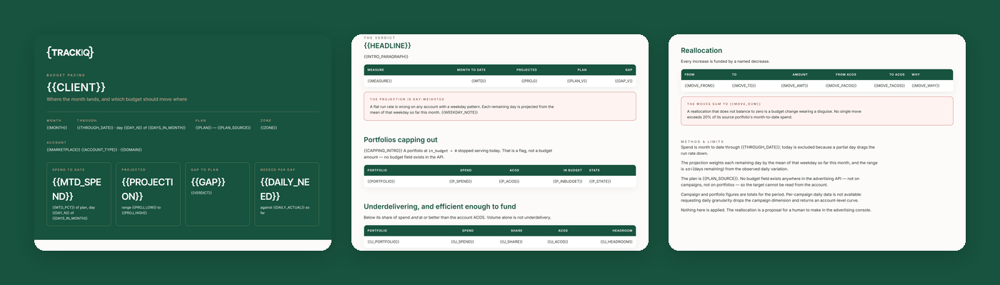

# TrackIQ: Amazon Budget Pacing and Month-End Forecast

Replaces the spreadsheet somebody rebuilds by hand on the 20th. **Are we going to hit the number, and which budget should move where?**

Output is a branded HTML report: the projection, the portfolios off pace, and a reallocation table.

Part of **Amazon Sponsored Ads** in the
[TrackIQ skills catalog](https://github.com/TrackIQ-HQ/amazon-seller-skills).

Built as an [Agent Skill](https://code.claude.com/docs/en/skills). Runs in
Claude Code, Claude web, Claude desktop and ChatGPT from the same folder.

---

## Powered by the TrackIQ MCP

[](https://trackiq.com/mcp)

This skill reads your live Amazon account through the
**[TrackIQ MCP](https://trackiq.com/mcp)** — 16 tools connecting your AI
assistant to Amazon data:

Sales & Traffic · Orders · Inventory · Returns · Sponsored Products · Sponsored
Brands · Sponsored Display · Amazon DSP · AMC Cloud · Keywords · Search Terms ·
Targeting · Search Query Performance · Organic Rank · Best Seller Rank · Buy Box
History · Brand Analytics · Export

Works with Claude, ChatGPT and Cursor. **[Get access →](https://trackiq.com/mcp)**

---

## What you get



Builds a mid-month Amazon advertising pacing report — month-to-date spend against the plan, a day-weighted projection to month end, the gap in dollars, which portfolios are capping out before the day is over, which are underdelivering their share, and a reallocation table that moves budget from the second to the first. Use when the user asks about budget pacing, are we on budget, month-end forecast, will we hit the number, overspending or underspending, budget reallocation, or how much is left to spend this month.

### The rules that keep it honest

- **The plan comes from the user, not the API**
- **You cannot have daily spend per campaign in one call**
- **Weight the projection by day of week**
- **State the projection as a range, not a number**

The full list is in `SKILL.md`, and each one exists because getting it wrong
produces a confident, wrong answer rather than an obvious error.

## Requirements

- The TrackIQ MCP, for `list_marketplaces`, `get_account_overview`, `get_campaigns` and `get_portfolios`. - **The month's plan** — the spend target, and the sales or ACOS target if there is one. **This is not in the API.** Ask for it. Without it the report can project where spend lands but cannot say whether that is right. - Nothing else. No filesystem, no shell, no internet. - **Without the MCP:** works from a daily spend-and-sales export for the month to date plus the plan number.

---

## Install

### Claude Code

```
/plugin marketplace add TrackIQ-HQ/amazon-seller-skills
/plugin install trackiq-amazon-budget-pacing@trackiq
```

### Claude web, desktop, mobile

1. Download the `.zip` from the
   [latest release](https://github.com/TrackIQ-HQ/trackiq-amazon-budget-pacing/releases)
2. **Settings → Capabilities → Skills** (code execution must be on)
3. **Create skill → Upload a skill**, choose the `.zip`
4. Toggle it on

### ChatGPT

Same zip. **Plugins → Skills → Create → Upload from your computer.**

---

## Setup

Answers live in `account.md`, copied from
[`assets/account.example.md`](skills/trackiq-amazon-budget-pacing/assets/account.example.md).
**Every TrackIQ skill reads the same file**, so an account already set up for
another TrackIQ report needs nothing added.

## Delivery

Asked once and stored in `account.md`: **in-chat** (default), **file**,
**Slack**, **n8n** or **email**. Anything leaving the chat confirms with you
first and falls back to in-chat, with a note.

---

## Customizing

| File | What it controls |
|---|---|
| `checks.md` | the pre-send checks |
| `method.md` | the method and every threshold |
| `pulls.md` | the call sequence and its traps |
| `report-template.html` | the report shell |

---

## Contributing

```bash
python scripts/validate.py    # must exit 0 before any commit
python scripts/build.py       # writes dist/ zip + registry.json
```

Read [AUTHORING.md](https://github.com/TrackIQ-HQ/amazon-seller-skills/blob/main/AUTHORING.md)
before proposing changes.

## License

MIT. See [LICENSE](LICENSE).
